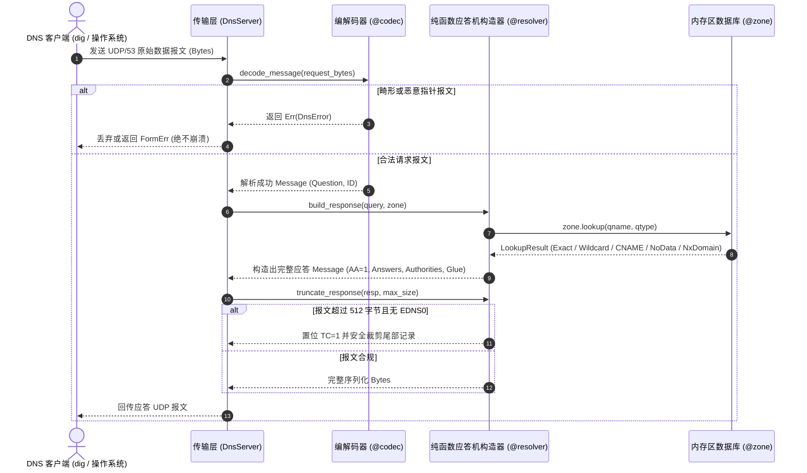

# MoonDNS 架构设计全景指南 (Architecture Guide)

本文档面向系统架构师与网络开发者，深入剖析 **MoonDNS (`chgttyyr/moon_dns`)** 的全链路设计原理、分层解耦拓扑、纯函数状态机与关键算法实现。

---

## 1. 顶层设计原则：协议与 I/O 的绝对解耦 (Zero-I/O Core)

传统 DNS 服务器（如 BIND9、PowerDNS 等）往往将底层 Socket 读写与协议解析深度混杂，使得在单元测试、跨平台移植或 WebAssembly 沙箱部署时面临严重的平台依赖与测试困难。

MoonDNS 从第一行代码开始，严格贯彻**“协议与传输层彻底分离”**的核心准则：

```
+-------------------------------------------------------------------------------+
|                             网络/应用宿主环境                                   |
|   (Linux / Windows / macOS / WebAssembly / Cloudflare Workers / Node.js)      |
+-------------------------------------------------------------------------------+
                                      │
                                      ▼
+-------------------------------------------------------------------------------+
|                   传输适配层 (Transport Layer: src/transport)                  |
|    - 异步 UDP / TCP Socket 监听器 (基于 moonbitlang/async/socket)               |
|    - TCP 2 字节大端序长度帧打包 / 解包 (RFC 1035 4.2.2)                          |
|    - 零 I/O 纯内存测试管道 (handle_dns_packet: Bytes -> Result[Bytes, DnsError])|
+-------------------------------------------------------------------------------+
                                      │
                                      ▼
+-------------------------------------------------------------------------------+
|                   权威应答状态机 (Resolver Layer: src/resolver)                 |
|    - 纯函数应答构建器 (build_response: (Message, Zone) -> Message)             |
|    - RFC 权威语义实施 (AA=1, NXDOMAIN, NODATA, CNAME 追踪展开, Glue 自动合成)     |
|    - 512 字节 / EDNS0 报文安全截断引擎 (truncate_response: TC=1 标记)           |
+-------------------------------------------------------------------------------+
                  │                                             │
                  ▼                                             ▼
+------------------------------------+        +---------------------------------+
|      区数据引擎 (src/zone)         |        |     编解码核心 (src/codec)       |
|  - In-Memory Zone 倒排索引数据库    |        |  - Message 完整 Wire Format 编解码|
|  - 通配符匹配引擎 (*.domain)       |        |  - Header 12 字节位操作解包/封包  |
|  - BIND 风格 Master File 语法解析器|        |  - Question / Resource Record   |
+------------------------------------+        +---------------------------------+
                                                                │
                                                                ▼
+-------------------------------------------------------------------------------+
|                   安全指针压缩引擎 (src/compression)                            |
|    - 四重防循环/越界安全守卫 (自环拦截, 双向环拦截, 前向越界校验, 128 跳上限)     |
|    - 自适应后缀词典编码器 (Adaptive Outbound Suffix Compression Dictionary)     |
+-------------------------------------------------------------------------------+
                  │                                             │
                  ▼                                             ▼
+------------------------------------+        +---------------------------------+
|      域名规范化 (src/domain)       |        |    安全二进制流 (src/bytes_io)   |
|  - FQDN 规范化与点号自动维护        |        |  - 边界检查大端序字节读取器 (Reader)|
|  - ASCII 大小写不敏感快速匹配      |        |  - 动态内存字节写入器 (Writer)   |
|  - 变长 Label 长度前缀序列化       |        |  - patch_uint16 原地长度回填机制 |
+------------------------------------+        +---------------------------------+
                                      │
                                      ▼
+-------------------------------------------------------------------------------+
|                      统一类型与错误领域模型 (src/types)                         |
|   Header, Question, Record, RData (A, AAAA, CNAME, NS, MX, TXT, SOA, OPT...), |
|   RType, RClass, RCode, OpCode, DnsError                                      |
+-------------------------------------------------------------------------------+
```

---

## 2. 核心执行流与应答生命周期 (Request Lifecycle)

当一个网络 UDP 数据包到达 MoonDNS 时，经历以下严密处理步骤：



---

## 3. RFC 权威语义决策矩阵 (Decision Matrix)

对于传入的 `Question(name, qtype)`，MoonDNS 遵循严格的标准决策树：

| 查询结果分支 | RCODE | AA 标志位 | ANCOUNT | Authority Section 行为 | Additional Section 行为 |
|---|---|---|---|---|---|
| **精确命中 (ExactMatch)** | `NoError` (0) | `true` | $\ge 1$ | 为空 | 自动补充 NS / MX 服务器的 Glue IP 记录 |
| **通配符命中 (WildcardMatch)** | `NoError` (0) | `true` | $\ge 1$ | 为空 | 将记录名称动态合成客户端请求的原名 |
| **别名追踪 (CNameMatch)** | `NoError` (0) | `true` | $\ge 2$ | 为空 | 同时包含 CNAME 别名与最终目标 A/AAAA 记录 |
| **存在域名但无类型 (NoData)** | `NoError` (0) | `true` | `0` | **必须携带该 Zone 的 SOA 记录** | 携带 EDNS0 OPT（若协商） |
| **域名完全不存在 (NxDomain)** | `NXDomain` (3) | `true` | `0` | **必须携带该 Zone 的 SOA 记录** | 携带 EDNS0 OPT（若协商） |
| **非负责域名 (NotAuthoritative)** | `Refused` (5) | `false` | `0` | 为空 | 为空 |

---

## 4. 性能与内存优化策略

1. **零内存拷贝切片**：在指针解压和报文校验时，尽可能复用只读的 `Bytes` 切片，避免过度的内存分配。
2. **大端序原地回填 (In-place Patching)**：在序列化 Resource Record 时，先写入 2 字节 `0x0000` 作为 `RDLENGTH` 占位，写入完成后直接通过 `writer.patch_uint16` 原地回填长度，完全免除了先编码到临时 Buffer 再拷贝的双重内存开销。
3. **自适应后缀字典**：只在报文内部维护单次会话的后缀哈希字典，并在离开序列化函数后立即销毁，不占用全局垃圾回收负担。
